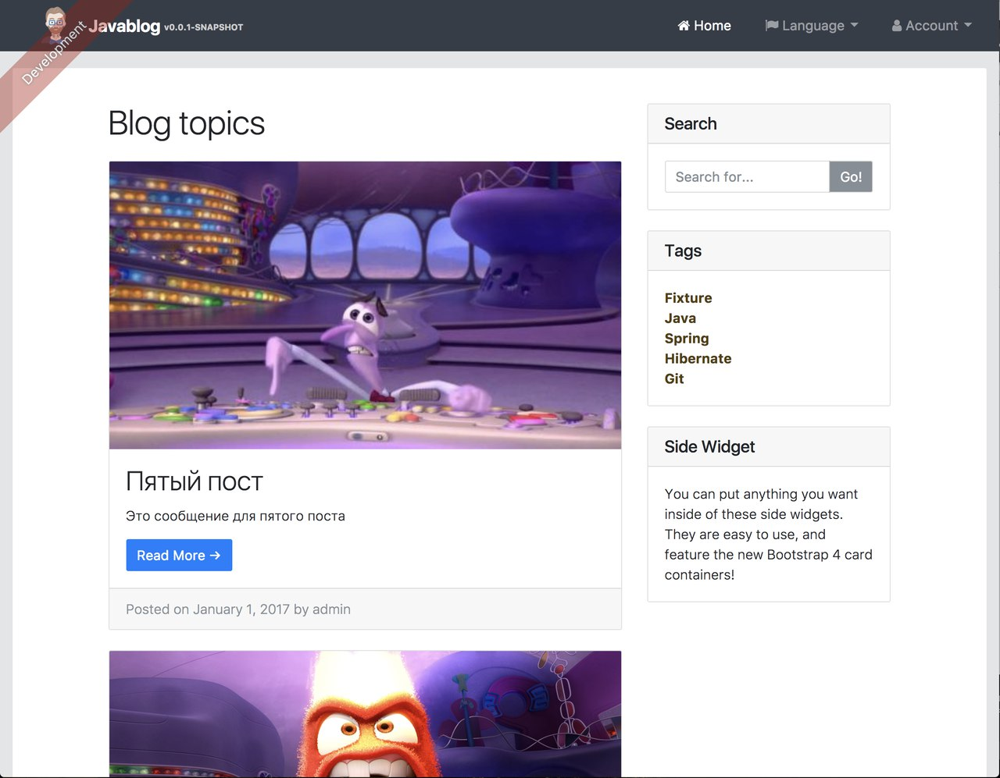
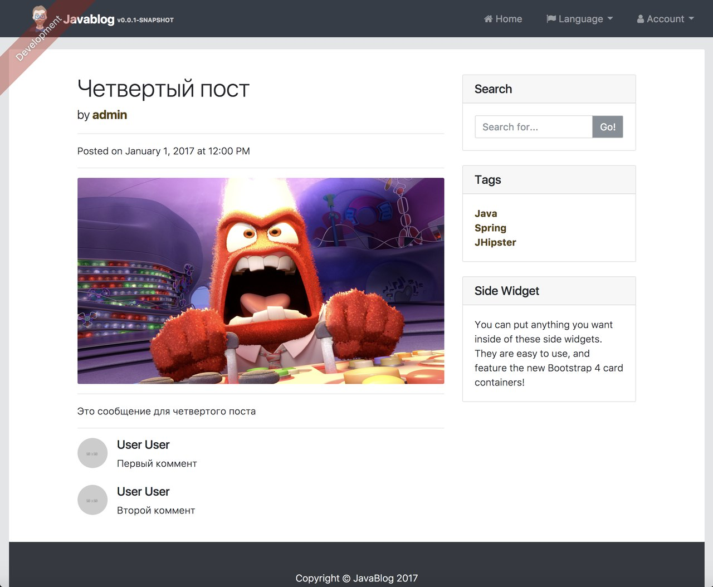

# javablog

Hello, this is a javablog project.

## How start it

    git clone
----
    yarn install
----
    ./gradlew
    yarn start

Then navigate to [http://localhost:8080](http://localhost:8080) in your browser.

## Testing

To launch your application's tests, run:

    ./gradlew test

### Client tests

Unit tests are run by [Karma][] and written with [Jasmine][]. They're located in [src/test/javascript/](src/test/javascript/) and can be run with:

    yarn test

## Screenshots

### Index page

### Blog detail page

